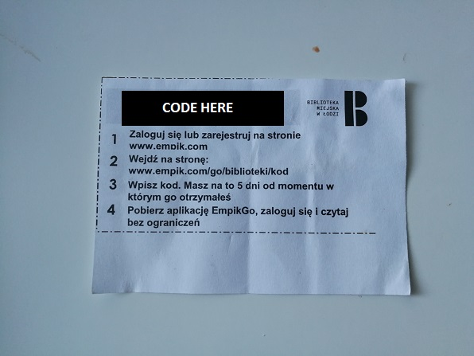
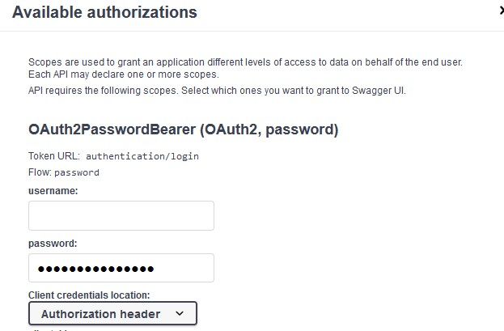
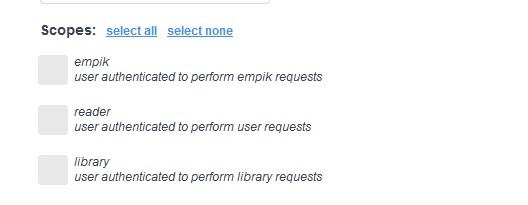
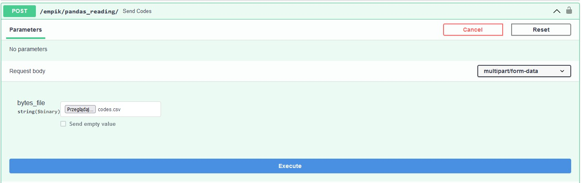
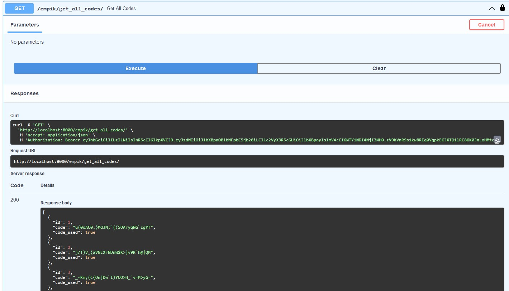
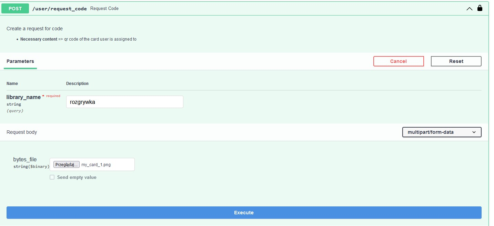
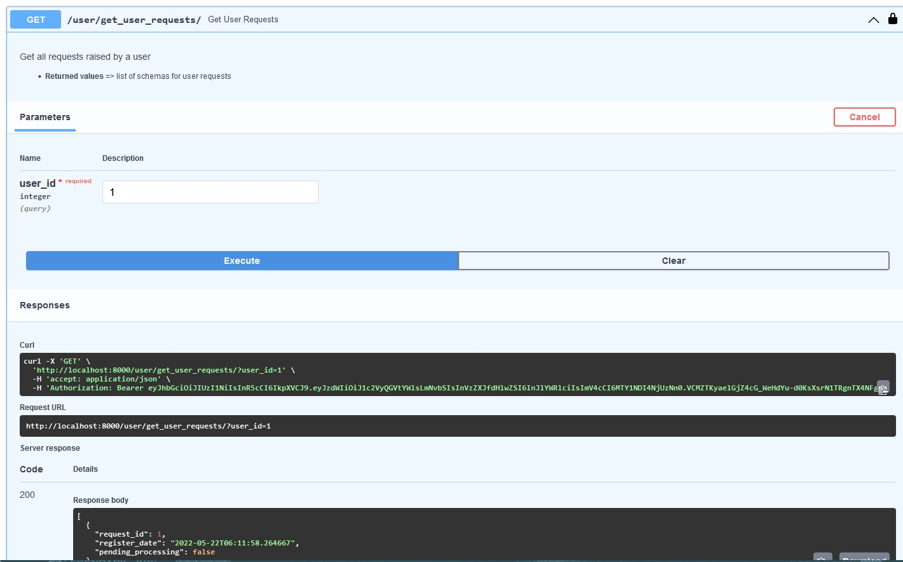
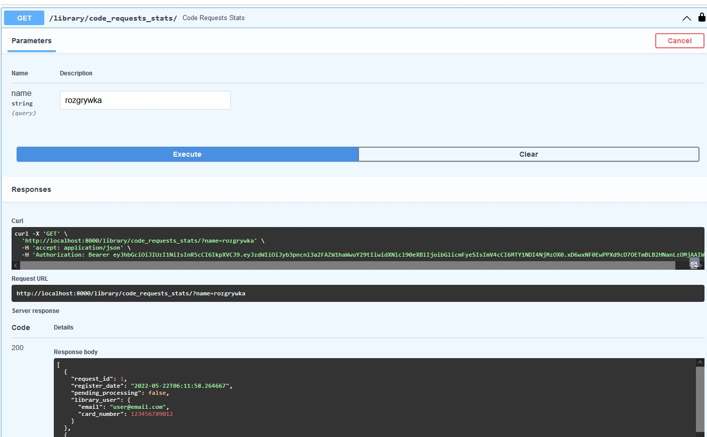
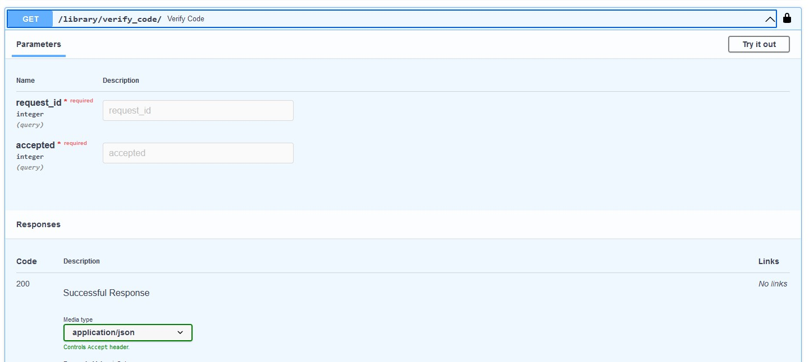
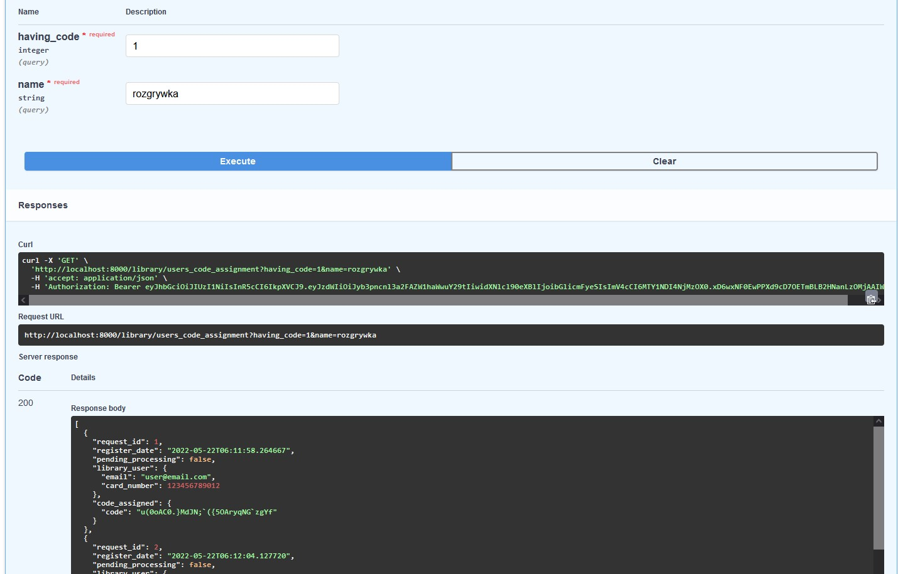

# EmpikGo codes sharing API

## Assumption of the project
Libraries in my city share the codes for E-Books platform w ith people that are users of the libraries and have a personal library card. But these codes are shared by giving people a slip of paper with a code on it (and instruction on how to further proceed to get the access). I thought that maybe there could be an option to create an API which would make this process more digital. That's how I came up with an idea to create an API for this purpose

## Description of how API works
* There are three user account types: empik, library and user
* Each user type has its own functions and paths

* Authorization is not required for creation of users but all other routes are secured and require token authentication
* In order to log in - user need to enter email and password. Also scope needs to be indicated as this will allow access to relevant endpoints (token will be generated)

### Empik

* Empik user can send codes which will be available for users in csv file. All codes sent will be saved in the database

* Empik user can check the statuses of codes (if they were used or not)

### Reader/Library user

* Reader/person using library can request a code

* He/She can also check if raised request is still processed or it is closed

### Library

* Library can check all requests that were are to it

* Library can verify the request and either accept it or reject it

* Library can see in which request codes were assigned and which ones 

## Technologies
* Python (FastAPI, SQLAlchemy, pandas)
* JWT

